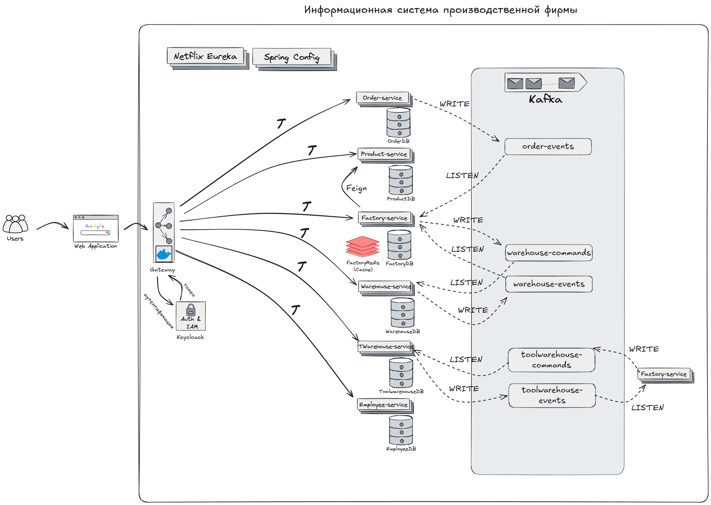

# Firm System — API фрагмента информационной системы производственной фирмы

   


## О проекте
Firm System — это RESTful API, разработанное на базе Spring Boot. Приложение представляет собой фрагмент информационной системы производственной фирмы, который будет обеспечивать
*  Управление производственным циклом инструментов
*  Управление производственным циклом материалов
*  Управление выпускаемой продукцией
*  Управление операциями
*  Управление нарядами
*  Управление цехами
*  Ведение отчетности
  
## Ключевые особенности
<table>
<tr>
<td>

🏢 **Микросервисная архитектура**
- Разделенные сервисы согласно бизнес-логике
- Независимое развертывание и масштабирование
  
🌱 **Spring Boot и Spring Cloud**
- Регистрация сервисов (Eureka)
- API Gateway (Spring Cloud Gateway)
- Сервис конфигураций (Spring config)
- Circuit Breakers & Fallback method (Resilience4j)

</td>
<td>

🐳 **Контейнеризация**
- Контейнерезированные сервисы
- Docker Compose оркестрация

📡 **Событийно-ориентированная архитектура**
- Apache Kafka брокер сообщений
- Асинхронное взаимодействие сервисов

</td>
</tr>
<tr>
<td>

🗄️ **Базы данных**
- PostgreSQL
- Redis
- Liquibase управление схемой

</td>
<td>

🔍 **Обнаружение сервисов**
- Регистрация сервисов через Eureka 
- Динамическая регистрация сервисов
- Проверка работоспособности сервисов

🛡️ **Безопасность**
- Spring Security и OAuth2

</td>
</tr>
</table>

## Стек технологий
*   **Язык:** Java 21
*   **Фреймворк:** Spring Boot 3 и Spring Cloud
*   **База данных:** PostgreSQL
*   **Кеширование** Redis
*   **Миграции БД** Liquibase
*   **ORM** Hibernate 
*   **Брокер сообщений** Apache Kafka
*   **Контейнеризация** Docker


## Сервисная архитектура

> Factory-service был продублирован для удобства, чтобы показать все топики, с которыми он взаимодействует

## Компоненты
<div align="center">

| Сервис | Порт | Краткое описание | Тех стек |
|---------|------|-------------|------------|
| **Gateway Service** | 8072 | Единая точка входа, маршрутизация и балансировка нагрузки | Spring Cloud Gateway |
| **Config Service** | 8071 | Централизованное управление конфигурацией | Spring Cloud Config |
| **Eureka Service** | 8070 | Обнаружение сервисов с Eureka | Spring Cloud Netflix |
| **Order Service** | 8082 | Взаимодействие с заказами | PostgreSQL + Liquibase (YAML) |
| **Product Service** | 8081 | Взаимодействие с товарами | PostgreSQL + Liquibase (YAML) |
| **Factory Service** | 8083 | Жизненный цикл обработки заказа | PostgreSQL + Liquibase (YAML) + Redis |
| **Warehouse Service** | 8084 | Склад материалов | PostgreSQL + Liquibase (YAML) |
| **Toolwarehouse Service** | 8085 | Склад инструментария | PostgreSQL + Liquibase (YAML) |
| **Employee Service** | 8080 | Взаимодействие с работниками | PostgreSQL + Liquibase (YAML) |

</div>

## Установка и запуск
Перед началом убедитесь, что у вас установлены:

| Инструмент | Версия | Назначение |
|------------|--------|------------|
| ☕ **Java** | 21+ | Среда выполнения |
| 📦 **Maven** | 3.9.x+ | Сборка проекта |
| 🐳 **Docker** | Latest | Контейнеризация сервисов|

### 🔨 Сборка проекта

1. **Клонируйте репозиторий:**
   ```bash
   git clone https://github.com/Veteroch4k/Firm-system.git
   cd Firm-system
   ```

2. **Соберите все модули:**
   ```bash
   mvn clean package -DskipTests
   ```
### 🚀 Запуск приложения

Выберите один из следующих вариантов развертывания:

#### Вариант 1: Поднятие всех сервисов
Идеально для локального запуска и тестирования функциональности:  
(*Не забудьте перейти в директорию c **docker-compose.yaml** файлом: /docker*)
```bash
# Первый запуск
docker-compose up -d

# Повторный запуск
docker-compose start

# Запуск отдельного контейнера
docker-compose start <название сервиса>
```
#### Вариант 2: Локальное тестирование
Если хочется проверить работу пары отдельных сервисов 
```bash
# Первый запуск
docker-compose up -d postgres config-server <название сервиса>

# Повторный запуск 
docker-compose start

# Запуск отдельного контейнера
docker-compose start <название сервиса>
```
### 🛑 Остановка сервисов

```bash
# Остановка и удаление всех контейнеров
docker-compose down

# Остановка всех контейнеров (без удаления)
docker-compose stop

# Точечная остановка
docker-compose stop <название_контейнера>
```
## Доступ к API
### 🔍 Регистрация сервисов (Eureka)
Мониторинг всех зарегистрированных микросервисов и их работоспособности:
- **Дашбоард:** [http://localhost:8070/](http://localhost:8070/)
- **Функции:** Мониторинг работоспособности сервисов в режиме реального времени
### 📈 Apache Kafka 
Управление кластерами Apache Kafka
- **Дашбоард:** [http://localhost:8090/](http://localhost:8090/)
- **Функции:** Мониторинг потоков данных
### 📚 Документация

## Запуск тестов


