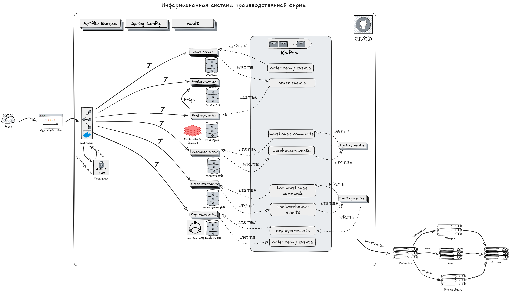
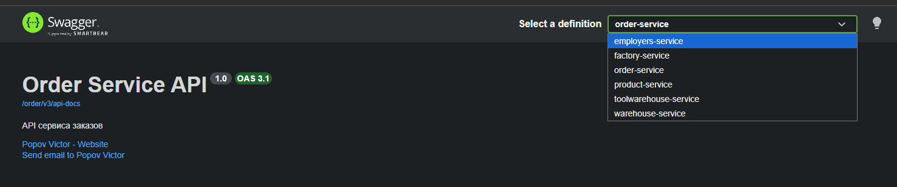

# Firm System — API фрагмента информационной системы производственной фирмы

   


[](https://github.com/Veteroch4k/Firm-system/actions/workflows/deploy.yml)

## Firm System Architecture

> Factory-service был продублирован для удобства, чтобы показать все топики, с которыми он взаимодействует
 
## 📖 Содержание
- [🎯 О проекте](#-о-проекте)
- [✨ Ключевые особенности](#-ключевые-особенности)
- [🏗️ Стек технологий](#-стек-технологий)
- [📦 Компоненты](#-компоненты)
- [🔗 Установка и запуск](#-установка-и-запуск)
- [🎛️ Доступ к API](#-доступ-к-api)
- [🔐 Keycloak Security Конфигурация](#-keycloak-security-конфигурация)
- [🔐 Хранение секретов Vault](#-хранение-секретов-vault)
- [📊 Мониторинг](#-мониторинг)
- [🗃️ База данных](#-база-данных)
- [🪟 Конфигурации сервисов](#-конфигурации-сервисов)
- [🧪 Тестирование](#-тестирование)
## 🎯 О проекте
Firm System — это RESTful API, разработанное на базе Spring Boot. Приложение представляет собой фрагмент информационной системы производственной фирмы, который будет обеспечивать
*  Управление производственным циклом инструментов
*  Управление производственным циклом материалов
*  Управление выпускаемой продукцией
*  Управление операциями
*  Управление нарядами
*  Управление цехами
*  Ведение отчетности
  
## ✨ Ключевые особенности
<table>
<tr>
<td>

🏢 **Микросервисная архитектура**
- Разделенные сервисы согласно бизнес-логике
- Независимое развертывание и масштабирование
  
🌱 **Spring Boot и Spring Cloud**
- Регистрация сервисов (Eureka)
- API Gateway (Spring Cloud Gateway)
- Сервис конфигураций (Spring config) + хранение секретов (Vault)
- Circuit Breakers & Fallback method (Resilience4j)

</td>
<td>

🐳 **Контейнеризация**
- Контейнерезированные сервисы
- Docker Compose оркестрация

📡 **Событийно-ориентированная архитектура**
- Apache Kafka брокер сообщений
- Асинхронное взаимодействие сервисов

</td>
</tr>
<tr>
<td>

📊 **Мониториг сервисов**
- Сбор метрик (Prometheus)
- Дашбоарды и визуализация (Grafana) 
- Распределенная трассировка (Micrometer + Tempo)
- Централизованные логи (Loki)

🗄️ **Базы данных**
- PostgreSQL
- Redis
- Liquibase управление схемой

</td>
<td>

🔍 **Обнаружение сервисов**
- Регистрация сервисов через Eureka 
- Динамическая регистрация сервисов
- Проверка работоспособности сервисов

🛡️ **Готовность к продакшену**
- Spring Security и OAuth2
- CI/CD с GitHub Actions
- Unit и интеграционные тесты

</td>
</tr>
</table>

## 🏗️ Стек технологий
*   **Язык:** Java 21
*   **Фреймворк:** Spring Boot 4 и Spring Cloud
*   **База данных:** PostgreSQL
*   **Кеширование** Redis
*   **Миграции БД** Liquibase
*   **ORM** Hibernate 
*   **Брокер сообщений** Apache Kafka
*   **Контейнеризация** Docker
*   **Тестирование** JUnit + Testcontainers


## 📦 Компоненты
<div align="center">

| Сервис | Порт | Краткое описание | Тех стек |
|---------|------|-------------|------------|
| **Gateway Service** | 8072 | Единая точка входа, маршрутизация и балансировка нагрузки | Spring Cloud Gateway |
| **Config Service** | 8071 | Централизованное управление конфигурацией | Spring Cloud Config |
| **Eureka Service** | 8070 | Обнаружение сервисов с Eureka | Spring Cloud Netflix |
| **Admin Service** | 8099 | Администрирование сервисов | Spring Boot Admin |
| **Order Service** | 8082 | Взаимодействие с заказами | PostgreSQL + Liquibase (YAML) |
| **Product Service** | 8081 | Взаимодействие с товарами | PostgreSQL + Liquibase (YAML) |
| **Factory Service** | 8083 | Жизненный цикл обработки заказа | PostgreSQL + Liquibase (YAML) + Redis |
| **Warehouse Service** | 8084 | Склад материалов | PostgreSQL + Liquibase (YAML) |
| **Toolwarehouse Service** | 8085 | Склад инструментария | PostgreSQL + Liquibase (YAML) |
| **Employee Service** | 8080 | Взаимодействие с работниками | PostgreSQL + Liquibase (YAML) |

</div>

## 🔗 Установка и запуск
Перед началом убедитесь, что у вас установлены:

| Инструмент | Версия | Назначение |
|------------|--------|------------|
| ☕ **Java** | 21+ | Среда выполнения |
| 📦 **Gradle** | 9.7.1+ | Сборка проекта |
| 🐳 **Docker** | Latest | Контейнеризация сервисов|

### 🔨 Сборка проекта

1. **Клонируйте репозиторий:**
   ```bash
   git clone https://github.com/Veteroch4k/Firm-system.git
   cd Firm-system
   ```

2. **Соберите все модули:**
   ```bash
   ./gradlew build
   ```
### 🚀 Запуск приложения

Выберите один из следующих вариантов развертывания:

#### Вариант 1: Поднятие всех сервисов
Идеально для локального запуска и тестирования функциональности:  
(*Не забудьте перейти в директорию c **docker-compose.yaml** файлом: /docker*)
```bash
# Первый запуск
docker-compose up -d

# Повторный запуск
docker-compose start

# Запуск отдельного контейнера
docker-compose start <название сервиса>
```
#### Вариант 2: Локальное тестирование
Если хочется проверить работу пары отдельных сервисов 
```bash
# Первый запуск
docker-compose up -d postgres config-server <название сервиса>

# Повторный запуск 
docker-compose start

# Запуск отдельного контейнера
docker-compose start <название сервиса>
```
### 🛑 Остановка сервисов

```bash
# Остановка и удаление всех контейнеров
docker-compose down

# Остановка всех контейнеров (без удаления)
docker-compose stop

# Точечная остановка
docker-compose stop <название_контейнера>
```
## 🎛️ Доступ к API
### 🔍 Eureka UI
Мониторинг всех зарегистрированных микросервисов и их работоспособности:
- **Дашбоард:** [http://localhost:8070/](http://localhost:8070/)
- **Функции:** Мониторинг работоспособности сервисов в режиме реального времени
### 📚 Документация
Доступ ко всем API микросервисов через агрегированный интерфейс Swagger:
- **Swagger UI:** [http://localhost:8072/swagger-ui.html](http://localhost:8072/swagger-ui.html)
- **Features:** API агрегация, аутентификация



> 💡 **Pro Tip:** Используя выпадающее меню, можно переключаться между API различных сервисов

### 📈 Apache Kafka UI
Управление кластерами Apache Kafka
- **Дашбоард:** [http://localhost:8090/](http://localhost:8090/)
- **Функции:** Мониторинг потоков данных

## 🔐 Keycloak Security Конфигурация
В директории docker/ лежит файл конфигурации для Keycloak, который импортируется при первом запуске. Создаются два пользователя с ролью 'USER' user-user и 'ADMIN' veteroch4k-admin (login-password) в firm-realm и глобальный admin-admin.
Однако же, если вдруг конфигурация не применилась - ниже описаны шаги по настройке Keycloak

### 1. Создайте реалм firm-realm
1. Откройте интерфейс Keycloak (`http://localhost:8181`).
2. В левом меню нажмите на выпадающий список (там будет либо Keycloak, либо master)
3. Нажмите **Create realm** 
4. В поле **Realm name** впишите firm-realm и переключите **Enabled** на 'on'.

### 2. Создайте роль ADMIN
1. Перейдите в только что созданный нами реалм (в том же выпадающем меню, где мы создали его)
2. Перейдите в раздел **Realm Roles** и нажмите **Create Role**
3. Назначьте имя 'ADMIN', описание можно оставить пустым
4. Нажмите **Save**
5. Name the role **`ADMIN`** and click **Save**.

### 3. Создайте ADMIN-юзера 
1. Перейдите в раздел **Users** и нажмите **Add user**
2. **Email verified** переключите на 'Yes'
3. Заполните username (в моем случае veteroch4k)
4. Нажмите **Save** и перейдите в **Credentials**.
5. Назначьте ему пароль **Set password** и переключите **Temporary** на 'Off' и сохраните.
6. Перейдите в раздел **Role mapping**, нажмите на **Assign role** и назначьте ему ранее созданную нами роль 'Admin' - **Assign**

### 4. Создайте роль SERVICE
1. Проделайте те же шаги, как и во втором шаге

### 5. Создайте клиента factory-client 
1. Перейдите в раздел **Clients** и нажмите **Create client**
2. **Client id** назначаете factory-client
3. После выставляете галочки у **Client authentication** и **Service accounts roles** (у остальных галочки убираете)
4. **Access settings** оставляете пустыми.
5. После создания перейдите в **Service accounts roles** и назначьте ему ранее созданную нами роль 'SERVICE'

### 6. Создайте клиента gateway-client 
1. Проделайте те же шаги, как и во втором шаге, но с некоторыми уточнениями:
2. **Client id** назначаете gateway-client
3. После выставляете галочки у **Client authentication** и **Standart flow ** (у остальных галочки убираете)
4. **Valid redirect URIs** 'http://localhost:8072/*' и Web origins '+'.
5. Роль 'SERVICE' назначать не надо.

### 7. При деплое (в моем случае self-hosted)
1. У 'gateway-client' в валидные редиректы также стоит указать айпишник (или, если назначили, доменное имя) сервера
2. Так же в основном и firm-realm перейти в **Realm settings** и выставить **Require SSL** на 'None' (в проде так делать явно не стоит)

## 🔐 Хранение секретов Vault
конфиденциальные данные не принято хранить в конфигурационных файлах или где-то в открытом доступе. Для таких случаев используют хранилище секретов.  
В моем случае данные для клинтов Keycloak (их client-secret), а также данные для подключения к конфиг-репозиторию на гите  хранятся в Vault.
Если вы тоже желаете использовать его в этих целях, ознакомьтесь с докой: https://developer.hashicorp.com/vault/tutorials/get-started-for-developers

## 📊 Мониторинг

### 📈 Метрики, логи и трейсы

<table>
<tr>
<td width="50%">

**🔍 Prometheus**
- **URL:** [http://localhost:9090](http://localhost:9090)
- **Purpose:** Сбор метрик
  
**📊 Grafana**
- **URL:** [http://localhost:3000](http://localhost:3000)
- **Credentials:** `admin/admin`
- **Features:** Дашбоард и визуализация данных

</td>
<td width="50%">

**📋 Компоненты стека:**
- **Loki:** Агрегация логов (`http://localhost:3100`) 
- **Tempo:** Хранилище распределенных трейсов (`http://localhost:3200`) 
- **OpenTelemetry Collector:** Шлюз телеметрии (`4317` / `4318`)
- **Dashboard ID:** `19004`
</td>
</tr>
</table>

### 🔍 Распределенные трейсы и логи

- **Интерфейс:** Единая точка входа для визуализации метрик, логов и трейсов находится в Grafana (`http://localhost:3000`).
- **Сбор трейсов:** Микросервисы отправляют трейсы через Micrometer Tracing в OpenTelemetry Collector (`otel-collector`), откуда они передаются в Tempo.
- **Сбор логов:** Loki принимает логи на порту `3100` 


## 🗃️ База данных

### 📊 Управление Liquibase схемой 
Проект использует контроль версий структуры базы данных посредством Liquibase. Changelog описаны в формате .yaml.

### 📂 Местоположение Changelog
```
src/main/resources/db/changelog/
├── db.changelog-master.xml     # Master changelog file
├── migrations/
│   ├── 001-initial-schema.xml
│   ├── 002-add-indexes.yaml
│   └── 003-data.json
```

### 🗄️ Структура БД
Для сервисов используется единая БД, поделенная на схемы для каждого сервиса.

<table>
<tr>
<td width="100%">

**🐘 PostgreSQL Schemas**
- 📚 product_service
- 📦 factory_service
- 📦 warehouse_service
- 📦 toolwarehouse_service
- 🛍️ order_service
- 💳 employer_service
</td>
</tr>
</table>

> 💡 **Best Practice:** Каждый сервис имеет свою собственную БД, следуя **database-per-service** паттерну

## 🪟 Конфигурации сервисов
Конфигурации всех микросервисов централизованно управляются с помощью **Spring Cloud Config Server**. В текущей реализации конфигурационные файлы хранятся в закрытом Git-репозитории, что обеспечивает безопасность, аудит изменений и удобное версионирование.

Spring Cloud Config Server поддерживает несколько профилей (бэкендов) для хранения конфигураций. Выбор зависит от окружения (локальная разработка, тест или прод):

* **🐙 Git (основной способ):**
  Настройки хранятся в удаленном репозитории (GitLab, GitHub, Bitbucket). Это стандартный подход для Production-среды.
  * *Преимущества:* Полная история изменений, возможность отката (rollback), удобное разделение по веткам (например, `main` для продакшена, `dev` для тестирования).

* **📁 Native (локальная файловая система):**
  Конфиги загружаются из локальной папки на сервере или из папки `resources` (classpath) самого Config Server. 
  * *Применение:* Идеально подходит для локальной разработки и отладки, когда нет стабильного доступа к интернету или не хочется делать коммит в Git ради мелкой правки. Включается флагом `spring.profiles.active=native`.

* **🔐 HashiCorp Vault (для секретов):**
  Используется для безопасного хранения чувствительных данных (пароли от БД, API-ключи, токены). Spring Cloud Config может работать в связке с Vault, подтягивая обычные настройки из Git, а секреты — из защищенного хранилища. *(В вашем стеке Vault как раз развернут и настроен!)*

* **🗃️ JDBC (База данных):**
  Конфигурации хранятся в виде строк в реляционной базе данных. 
  * *Применение:* Удобно, когда настройки нужно менять динамически через UI-админку без необходимости делать Git-коммиты, но требует дополнительных накладных расходов на создание таблиц.

> **💡 Примечание по безопасности:** При работе с Git-репозиторием доступ Config Server к конфигурациям осуществляется по SSH-ключу или Personal Access Token, поэтому конфиденциальные данные остаются в безопасности.


## 🧪 Тестирование
Проект имеет комплексное покрытие тестами для обеспечения надежности, безопасности и стабильности работы всех компонентов микросервисной архитектуры. В проекте реализованы следующие уровни тестирования:

* **🧩 Юнит-тесты (Unit Tests):**
  Изолированное тестирование слоев бизнес-логики (сервисов), мапперов и утилит с использованием **JUnit 5** и **Mockito** без поднятия контекста приложения.

* **🔗 Интеграционные тесты (Integration Tests):**
  Проверка корректного взаимодействия приложения с внешней инфраструктурой (PostgreSQL, Redis, Liquibase). Выполняется с поднятием легковесных, одноразовых контейнеров баз данных с помощью **Testcontainers**, что гарантирует чистоту каждого тестового прогона.

* **🌐 Web-тесты (API/MVC Tests):**
  Тестирование REST-контроллеров, сериализации/десериализации JSON, обработки исключений и валидации входящих запросов (с использованием `@WebMvcTest` и `MockMvc`).

* **🛡️ Security-тесты:**
  Проверка механизмов ролевого доступа (RBAC) к защищенным эндпоинтам с помощью Spring Security Test.

* **📨 Kafka-тесты:**
  Тестирование асинхронного, событийно-ориентированного взаимодействия. Проверка логики продюсеров и консюмеров, сериализации сообщений и правильности работы с топиками (с использованием Testcontainers для брокера Kafka).

### 🏃‍♂️ Запуск тестов

Для локального запуска тестов используется встроенный Gradle Wrapper:

```bash
# Запуск тестов во всех микросервисах проекта
./gradlew test

# Запуск тестов для конкретного сервиса (например, factory-service)
./gradlew :services:backend:factory-service:test
```

> **💡 Примечание:** Для успешного прохождения интеграционных и Kafka-тестов убедитесь, что у вас запущен Docker (Docker Desktop или демон в фоне), так как он необходим для работы Testcontainers.
